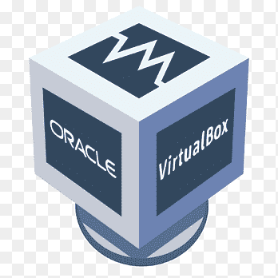
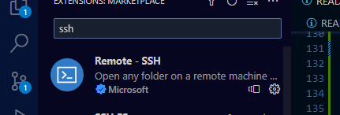
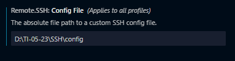

##preparação do ambiente 
###vamos preparar o ambiente para
desenvolvimento de aplicações

###neste ambiente iremos instalar e
configurar os seguintes recursos:

 maquina Virtual(virtualbox)
 -distribuição Linux(ubuntu server)
 -nasm
 -compilador da liguagem C
 -configurar o ip e a porta de 
 comunicação entre a maquina real e a 
 virtual
 -configurar o acesso via SSH entre o 
 VScode e o ServidorLinux
 -instalar as extensões:material
 icons, nasm, SSH e Linguagem C/C++

#### Maquina Virtual(virtualbox)




maquina é uma ferramenta que permite 
a criação de novos "computadores" e a 
instalação de sistemas operacionais,
para estudo ou trabalho.

para o nosso estudo iremos usar o
virtualBox, da oracle.
para instalar, basta fazer o download
no link a seguir:
<a href="https://www.virtualbox.org/wiki/Downloads" target="_blank">VirtualBox</a>

##### Criando a máquina virtual para o 
nosso estudo 

 -configuração: 
  > - nome da máquina:servidor
  > - memória: 4GB (4096)
  > - processador: 2
  > - Disco: 100GB
  > - ip e porta do host: 127.0.0.1 e 22
  > - ip e porta do convidado: 10.0.2.15 e 22

 -tela inicial de configuração


-tela  configuração de hardware
 


-tela de configuração de disco
 


-tela final de configuraçao 
 
 

-tela inicial de configuracao de rede
 


-tela inicial de configuracao de portas e ip
 


#### distribuiçao ubuntu server


para o nosso estudo iremos utilizar uma
distribuiçao Linux para servidores chamado Ubuntu.
acompanhe o processo de instalação

faca o download aqui:

<a href="https://ubuntu.com/download/server" target="_blank">VirtualBox</a>

-acompanhe a instalação

-tela de inicio de instalação


-tela de inicio


-tela de teclado 


-tela de tipo de instalação 


-tela de configuração de rede


tela de configuraçao de rede


tela de configuraçao de proxy 


#### Atualização do sistema 

```
sudo apt uptade -y && sudo apt upgrade -y
```
reinicie seu servidor usando o comando abaixo:

```
reboot
```

#### instalação do compilador Nasm
o compilador do NASM é uma ferramenta que nos permite programar 
em Assembly. Assim é possivel criar programas que manipulam 
dados que estão nos resgistradores do processador .

para instalar o NASM no Ubuntu, usamos o comando:

```
sudo apt install nasm -y 
```

#### instalação do compilador da linguagem C

em linux, o compilador da linguagem c é GCC. ele é uma 
ferramenta importante para o desenvolvimento de programas 
em C.

para instalar use o comando:
```
sudo apt install gcc -y
```
#### conexão servidor e VScode via ssh

precisamos instalar uma extensão no VScode  para acessar o nosso 
servidor de forma remota.



configuração do acesso remoto 


